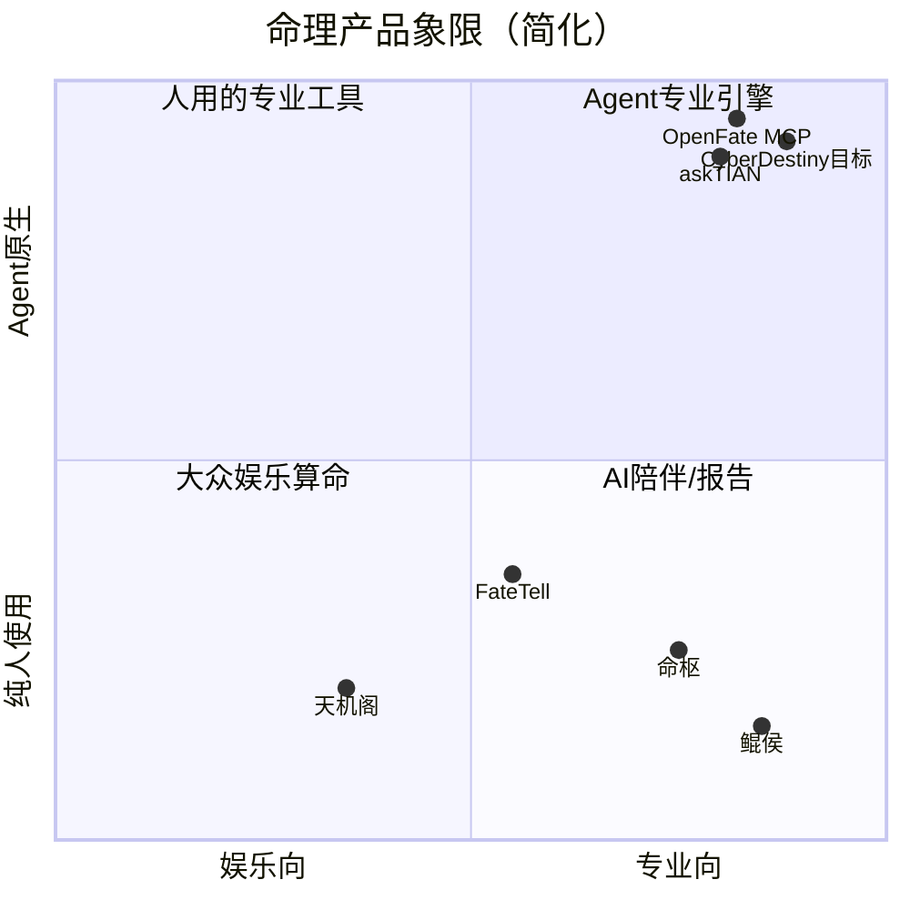

# CyberDestiny 行业调研报告

| 字段 | 内容 |
|------|------|
| 版本 | v0.1 |
| 日期 | 2026-06-29 |
| 关联 | [PRD.md](./PRD.md) |

---

## 1. 调研范围与方法

本报告覆盖 **2024–2026** 年国内外命理 / 玄学 AI / Agent API / 修行类产品的公开信息，重点对标：

- **C 端 AI 命理**：FateTell、天机阁、问天AI、顺时 ShunShi
- **专业排盘工具**：鲲侯（星河易道）、命枢、易百查专业版
- **Agent / API 基础设施**：askTIAN、OpenFate Bazi MCP、xuanxue-bazi-matching、FreeAstroAPI BaZi API
- **修行 / 身心**：墨尔冥想、Now 冥想、打坐日记、观吾道历、孙伦内观

信息来源：产品官网、App Store、36氪/腾讯新闻专访、API 文档。结论用于 CyberDestiny 功能优化、商业模式与修行扩展设计，**非竞品排名**。

---

## 2. 行业格局概览



**三类玩家：**

| 类型 | 代表 | 强项 | 弱项 |
|------|------|------|------|
| 出海 AI 报告派 | FateTell | 深度报告、订阅、品牌溢价 | 国内定价权弱；偏八字 |
| 国内工具/学习派 | 易百查、命枢、鲲侯 | 多术数、排盘准、案例管理 | Agent 集成弱；AI 解读参差 |
| 基础设施派 | askTIAN、OpenFate | MCP/API、确定性计算、按量付费 | 无 C 端体验；需上层产品 |

**CyberDestiny 差异化窗口：** 专业推演（六爻+八卦+风水+五行）+ **Agent/MCP 原生** + **典籍/fiction 分层知识库** + **修行闭环**——目前几乎没有产品四者兼备。

---

## 3. 标杆产品功能拆解

### 3.1 FateTell（出海 AI 八字）

| 维度 | 做法 | 可借鉴 |
|------|------|--------|
| 产品结构 | **命之书**（一生四专题）+ **运之书**（年月日） | 报告优先，非纯聊天 |
| UX 教训 | 早期 C.ai 式对话 → 用户「不知问什么」→ 改报告驱动 | **先出结构化报告，再基于报告 QA** |
| 技术 | 排盘算法外挂 + 多流派专家系统 + 真人命理师评测集 | 垂类 Agent 必须自建 **evaluation benchmark** |
| 商业 | 单次 ~$39.9；**70% 收入来自订阅**；付费率 ~5%，复购 ~39% | 订阅做「日/周能量提醒」比单次报告更稳 |
| 品牌 | 「效率工具 + 生活方式品牌」（对标 Notion + lululemon） | 弱化「算命」，强化「自我认知工具」 |
| 叙事 | 知命 → 认命 → **改命** | 与修行扩展天然衔接 |

### 3.2 天机阁 / 问天AI（国内 C 端）

| 功能 | 说明 |
|------|------|
| 多工具矩阵 | 八字、紫微、六爻、风水、姓名、择日、每日运势 |
| 免费 + 积分解锁 | 基础排盘免费，深度 AI 解读消耗积分 |
| 问天 AI 六爻 | 手动/自动起卦、问事类型、时辰信息、四柱反查 |

**启示：** 国内用户对「免费看到东西」预期高；可用 **免费日运摘要 + 付费/积分深度报告** 漏斗。

### 3.3 鲲侯 · 星河易道（专业排盘引擎）

| 功能 | 说明 |
|------|------|
| 四模块零切换 | 八字 ↔ 紫微 ↔ 奇门 ↔ 择吉，共享输入 |
| 多级流年 | 大运 → 流年 → 流月 → 流日 → 流时 |
| 快速输入 | `YYYYMMDDHHmm` 数字串、即时排盘 |
| 纯前端计算 | 隐私、秒级、离线知识库缓存 |
| 结构化知识库 | ~148 条：十神、神煞、称骨等 |

**启示：** CyberDestiny 的 Chart Engine 应支持 **流时级** 与 **快速输入**；敏感用户可选 **本地/边缘计算排盘**。

### 3.4 命枢（专业 + AI 桥接）

| 功能 | 说明 |
|------|------|
| 合盘、六爻、罗盘、择吉 | 一站式专业工具箱 |
| 古籍库 | 山医命相卜分类 |
| **AI 提示词导出** | 自动整理命盘信息，复制到外部 LLM | 
| 离线核心 | 隐私场景 |
| 子午流注 | 时辰养生 |

**启示：** 在 MCP 成熟前，**Prompt Export** 仍是有效桥接；子午流注可并入修行模块。

### 3.5 易百查（平台化）

| 功能 | 说明 |
|------|------|
| 大师入驻 | 200+ 命理师，一对一咨询 |
| 课程 IAP | 四柱/六爻课程 $39–99 |
| 题库 + 术语百科 | 学习闭环 |
| 合盘、多人盘 | 社交/婚恋场景 |

**启示：** 若做社区，**术语百科 + 案例库** 比「大师 marketplace」更贴合 CyberDestiny 专业定位（v2+ 可考虑 curated 专家审校，非撮合交易）。

### 3.6 askTIAN / OpenFate / xuanxue（Agent 基础设施）

| 产品 | 亮点 |
|------|------|
| **askTIAN** | 110 endpoints；**MCP 一等公民**；TIAN Blended 多体系合成 + LLM narrative + 0–100 score；按 TIAN Points 订阅 |
| **OpenFate** | calculation-first；开源 **Bazi MCP**；真太阳时；多语言 |
| **xuanxue-bazi-matching** | 确定性引擎；**x402 链上按次付费**；专为 autonomous agent 设计 |
| **FreeAstroAPI** | synastry、health TCM、**lifespan curve（内经曲线）** |

**启示：** CyberDestiny MCP 应强调 **确定性排盘 + 结构化 JSON + 版本化 Schema**；可预留 **按次 micropayment** 给无账号 Agent。

### 3.7 顺时 ShunShi（品牌与话术）

-  slogan：**「顺时而为，尽其天性」** — 不算命，陪你看清自己  
- 多体系统一入口（八字已上线，紫薇/易经/塔罗 roadmap）  
- **对话胜于断言**：不告诉「你会怎样」，而解释「为何、可怎么做」

**启示：** 与 CyberDestiny PRD 的「先释象后吉凶」一致，应在 UI 与 Agent Skill 中贯彻。

---

## 4. 值得 CyberDestiny 优化的功能清单

按优先级分为 **Must（差异化）** / **Should（行业标配）** / **Could（后期）**。

### 4.1 Must — 建议写入 PRD v0.2

| # | 功能 | 行业依据 | CyberDestiny 落地建议 |
|---|------|----------|------------------------|
| M1 | **计算优先架构** | FateTell、OpenFate、askTIAN | 排盘/卦变/飞星 100% 确定性；LLM 只负责释象 |
| M2 | **报告优先 UX** | FateTell 产品迭代 | Web/Agent 默认 `destiny_infer` → 完整报告 → 再 `report_qa` |
| M3 | **四尺度时间轴** | 鲲侯流时、PRD 已有 | day/week/year/lifetime 统一 timeline 组件，可对比 |
| M4 | **依据链（basis_refs）** | 专业工具 + RAG 产品 | 每条断语挂典籍/fiction_mapping/卦象步骤；UI 可折叠 |
| M5 | **MCP + Skill 双通道** | askTIAN、OpenFate | Tools 与 REST 同构；Skill 教 Agent 采集信息与转述 |
| M6 | **真太阳时 + 缺时辰模式** | 所有专业排盘 | 有地点则校正；无时辰则降级 + 明确 `confidence` |
| M7 | **六爻专业流** | 问天AI、命枢、易百查 | 时间卦/数字卦/手动摇卦；问事类型；世应用神链 |
| M8 | **fiction_mapping 分库** | CyberDestiny 独有 | 《一人之下》等仅作象意辅助，禁止单独作为断语依据 |

### 4.2 Should — 提升专业感与留存

| # | 功能 | 说明 |
|---|------|------|
| S1 | 快速输入 `YYYYMMDDHHmm`、即时排盘 | 鲲侯 |
| S2 | 档案合盘 / 双人对比 | 婚恋、合作；Agent 可 `profile_pair` |
| S3 | 择日 / 黄历 / 道历 | 观吾道历、askTIAN almanac；与 day scope 联动 |
| S4 | 术语百科 + 学习路径 | 易百查；降低专业门槛 |
| S5 | 案例库 / 推演快照 | 玄易、命枢；支持复盘与 A/B 换地点 |
| S6 | 专家评测集（offline eval） | FateTell；每版模型/regression 必跑 |
| S7 | 订阅推送 | 日运摘要、节气提醒、流年节点（FateTell 70% 收入） |
| S8 | 导出 PDF/Markdown + Agent deep link | 报告分享与二次解读 |
| S9 | 罗盘 / 方位建议 | 命枢；与风水模块绑定 |
| S10 | Prompt Export（过渡期） | 命枢；无 MCP 环境时复制结构化命盘 |

### 4.3 Could — 差异化实验

| # | 功能 | 说明 |
|---|------|------|
| C1 | TIAN 式 **多体系 Blended Score** | 仅六爻+八字+风水加权，非 58 体系大而全 |
| C2 | x402 / 按次 Agent 付费 | xuanxue；无账号 autonomous agent |
| C3 | 客户端排盘（WASM） | 鲲侯；隐私/离线 |
| C4 | 内经 lifespan / 体质 | FreeAstroAPI health；与五行喜忌结合 |
| C5 | 白标 SaaS | 36氪所述「卖铲子」；小 B 博主定制 |
| C6 | 大师审校（非撮合） | curated 报告复核，收 B2B 年费 |

---

## 5. 商业模式调研与建议

### 5.1 行业主流变现模式

| 模式 | 代表 | 收入结构 | 国内适用性 |
|------|------|----------|------------|
| **订阅会员** | FateTell、Now冥想 | 日/周推送、深度解读、多档案 | 出海高；国内需强价值感 |
| **按次报告** | FateTell 命之书 ~$39.9 | 高客单、低频 | 国内宜 ¥19–99 档 |
| **积分/点数** | 天机阁、askTIAN | 免费引流 + 消耗制 | 适合国内 |
| **课程/培训** | 易百查、Now冥想导师认证 | IAP $39–99 或年费培训 | 与「专业」品牌一致 |
| **大师佣金** | 易百查 | 咨询抽成 | 合规与品控成本高 |
| **衍生品电商** | 赛博算命 PM 文 | 五行缺补 → 水晶香薰 | 易低俗；CyberDestiny 不建议 v1 |
| **B2B API** | askTIAN、OpenFate | 按调用/订阅 | **Agent 时代增量最大** |
| **白标 SaaS** | 技术供应商 | 博主月费数百元 | 可开源核心 + 商业托管 |
| **企业 EAP** | Now冥想 B2B | 员工心理健康 | 修行模块延伸 |

### 5.2 FateTell 关键商业数据（公开报道）

- 海外 C 端；约 **盈亏平衡**
- 付费率 ~**5%**；复购 ~**39%**
- 收入 **70% 订阅 / 30% 单次**
- 定价约为真人命理师 **1/10**
- 品牌定位：**效率工具 + 生活方式**，非纯算命

### 5.3 国内 vs 出海

| 市场 | 特点 | 策略 |
|------|------|------|
| 国内 | 替代品多、虚拟服务付费弱、监管敏感 | 强调文化/自我认知；积分制；低价订阅 |
| 出海 | 文化溢价、Web 流量、订阅习惯好 | 英文报告、六爻/风水 exotic 定位 |

### 5.4 推荐给 CyberDestiny 的模式组合

CyberDestiny 面向 **个人 + Agent**，建议 **「开源核心 + 分层商业」**：

```
┌─────────────────────────────────────────────────────────┐
│  Layer 0: 开源自托管                                      │
│  Chart Engine + 基础 MCP + 本地 RAG + 日运摘要bod scope 限额   │
│  目标: 隐私用户、开发者、Agent 爱好者                       │
└─────────────────────────────────────────────────────────┘
                            │
┌─────────────────────────────────────────────────────────┐
│  Layer 1: CyberDestiny Cloud（个人 Pro）                  │
│  ¥38–68/月 或 $9.99/月                                   │
│  无限推演、year/lifetime、推送、多档案、PDF、优先模型        │
└─────────────────────────────────────────────────────────┘
                            │
┌─────────────────────────────────────────────────────────┐
│  Layer 2: Agent API                                      │
│  按 TIAN Points 类似：1 次 infer = N credits              │
│  或 x402 按次（无账号 Agent）                             │
│  MCP + REST 统一计费                                      │
└─────────────────────────────────────────────────────────┘
                            │
┌─────────────────────────────────────────────────────────┐
│  Layer 3: 修行 Plus（可选 bundle）                        │
│  Pro 内含 或 +¥19/月                                      │
│  每日功课、节气修行、AI 修行教练、打卡统计                   │
└─────────────────────────────────────────────────────────┘
                            │
┌─────────────────────────────────────────────────────────┐
│  Layer 4: Pro Studio（命理师/研究者，后期）                │
│  案例库、合盘、eval 导出、白标                             │
│  B2B 年费                                                 │
└─────────────────────────────────────────────────────────┘
```

**不建议 v1 做：** 大师 marketplace、开运电商、恐吓式付费墙。

**核心付费理由（学 FateTell）：**

1. **深度与准度** — 真人师级 7–8 成 + 可验证排盘  
2. **全尺度时间轴** — 日/周/年/一生一处看完  
3. **Agent 随时可用** — 个人 Agent 24h 代问  
4. **改命行动链** — 不只断语，还有修行/择时建议（见第 6 节）

---

## 6. 修行扩展（重点）

### 6.1 行业修行类产品启示

| 产品 | 核心功能 | 商业 | 对 CyberDestiny 的启发 |
|------|----------|------|------------------------|
| 墨尔冥想 | AI 导师、定制计划、1000+ 音频、硬件 | 订阅 + 硬件 | **个性化功课**可 AI 生成 |
| Now 冥想 | 分场景课程、7/21 天、B2B EAP、导师培训 | 会员 60% + 课程 40% | 阶梯式 **21 天知命修行** |
| 打坐日记 | 计时、排行、共修室、社区 | 会员云同步 | 轻量打卡 + 统计 |
| 观吾道历 | 道历、黄历、修行打卡 | 工具 + 商城 | **节气/道历**与命理联动 |
| 孙伦内观 | 共修、打卡日记、统计 | 免费共修 | 可选匿名共修 v2 |
| FateTell 叙事 | 知命→认命→**改命** | — | 修行是「改命」产品化 |

### 6.2 修行扩展的产品哲学

命理回答 **「天命如何展」**；修行回答 **「当下如何修」**。二者合成 **性命双修** 闭环：

- **命**：五行、大运、流年、卦象 — 客观时空结构  
- **性**：心性、专注、欲望、习气 — 主观可训练  

《一人之下》等 fiction_mapping 可提供 **现代语境**：术法需心性承载、过度依赖算命的局限等，但 **修行处方必须回到典籍**（道德经、南华经、内丹典籍选段）。

### 6.3 修行模块功能设计（Practitioner Module）

#### Phase A — 与命理强绑定（建议 Phase 1 末 / Phase 2）

| 功能 | 描述 | 与推演联动 |
|------|------|------------|
| **五行功课推荐** | 根据喜用神/当日五行旺衰推荐：色、音、行、息 | `day` scope 输出 `practice_hint` |
| **时辰修行窗** | 子午流注：今日宜静坐/动功的 2–3 个时辰 | 命枢子午流注 + 日柱 |
| **节气修行** | 24 节气日推送：收神/生发/藏精 | `year` scope + 黄历 |
| **立愿/回向** | 轻量记录修行 intention（非宗教强制） | 可选挂接报告 |
| **每日一典** | 《道德》《南华》一句 + 与当日卦象对照 | RAG 典籍 |
| **Agent: `practice_recommend`** | MCP tool，输入 profile + scope → 功课 JSON | Agent 对话内给修行建议 |

#### Phase B — 习惯与进阶（Phase 3）

| 功能 | 描述 |
|------|------|
| **打卡计时** | 静坐/诵经/吐纳；日周月年统计 |
| **21 天修行径** | 知命（读报告）→ 认命（观象）→ 改命（行动）结构化课程 |
| **共修（可选）** | 匿名同时段在线人数；无社交压力 |
| **修行报告** | 月度：功课完成度 × 运势自评 × 命盘节点回顾 |
| **B2B 轻量** | 企业「晨修 10 分钟」套餐（学 Now冥想） |

#### Phase C — 深度（长期，需内容审校）

| 功能 | 风险 | 建议 |
|------|------|------|
| 内丹/筑基次第 | 安全与合规 | 仅文献导读 + 免责声明，不教具体功法 |
| 符箓/法事 | 迷信与诈骗 | **不做** |
| 线下 OMO | 运营重 | 与道观/书院合作 content only |

### 6.4 修行扩展数据模型（草案）

```json
{
  "practice_plan_id": "uuid",
  "profile_id": "uuid",
  "derived_from_report_id": "uuid",
  "period": "daily|weekly|solar_term|21day",
  "items": [
    {
      "type": "meditation|breath|classic_reading|action",
      "title": "辰时静坐 15 分钟",
      "reason_basis": ["wuxing:水旺宜静", "classic:道德经-致虚极"],
      "duration_minutes": 15,
      "optional": false
    }
  ],
  "check_ins": []
}
```

### 6.5 修行相关的 Agent Skill 话术要点

- 不替代医疗/心理治疗；焦虑严重建议专业帮助  
- 修行建议 **可执行、可度量**（5–20 分钟级）  
- 引用 fiction 时用「象意参考」口吻，与典籍区分  
- 用户问「怎么改命」→ 报告中的 **行动建议 + 修行功课**，非「做法事」

---

## 7. 对 PRD 的修订建议摘要

| PRD 章节 | 建议变更 |
|----------|----------|
| 4.2 推演引擎 | 增加 **报告优先 + report_qa** 流程；流时级排盘 |
| 4.4 Agent | 增加 `practice_recommend`；API 点数计费说明 |
| 4.3 Web | 增加 timeline 对比、术语百科、择日/道历 |
| 5 架构 | 明确 **Chart Engine 确定性** + eval benchmark |
| 9 里程碑 | Phase 2 末插入 **修行 Phase A** |
| 12 开放问题 | 商业模式倾向 **开源 + Cloud Pro + Agent credits** |
| 新增 | 附录 C：竞品功能矩阵；附录 D：修行模块详规 |

---

## 8. 竞品功能矩阵（简表）

| 能力 | FateTell | 天机阁 | 鲲侯 | 命枢 | askTIAN | **CyberDestiny 目标** |
|------|----------|--------|------|------|---------|----------------------|
| 八字 | ✅ | ✅ | ✅ | ✅ | ✅ | ✅ |
| 六爻 | ❌ | ✅ | ❌ | ✅ | ✅ | ✅ **核心** |
| 风水/罗盘 | ❌ | ✅ | 择吉 | ✅ | 部分 | ✅ |
| 八卦/易经 | 部分 | ✅ | ❌ | ✅ | ✅ | ✅ **核心** |
| 多尺度运 | 年月日 | 日运 | 至流时 | 大运 | 依 endpoint | **日周年一生** |
| MCP/API | ❌ | ❌ | ❌ | ❌ | ✅ | ✅ **核心** |
| 报告依据链 | 部分 | ❌ | 知识库 | ❌ **fiction 分层** | ✅ |
| 修行/打卡 | ❌ | 祈福 | ❌ | 养生 | ❌ | ✅ **差异化** |
| 合盘 | ✅ | ✅ | ❌ | ✅ | ✅ | Should |
| 订阅推送 | ✅ | ✅ | ❌ | ❌ | ❌ | Should |

---

## 9. 结论

1. **功能上**：行业已证明「排盘算法 + 报告优先 + 订阅推送」可行；Agent 赛道 askTIAN/OpenFate 证明 **MCP + 确定性 JSON** 是下一波基础设施。CyberDestiny 应坚持 **六爻八卦风水五行深度 + 依据链 + 四尺度**，并补上 **修行改命闭环**。  
2. **商业上**：国内宜 **开源/自托管 + 积分/低价订阅**；出海可 **高价报告 + 订阅**；长期 **Agent API 按量** 是差异化收入。  
3. **修行扩展**：不是另做一个冥想 App，而是 **命理报告的「行动层」** — 五行功课、节气、子午流注、21 天径，与 Agent `practice_recommend` 一体，落实「知命→认命→改命」。

---

*下一步：若确认本调研方向，可更新 PRD v0.2 并输出修行模块独立 spec（`docs/practice-module.md`）。*
